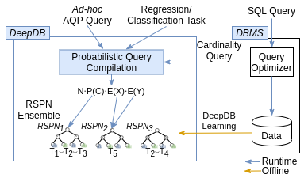

# DeepDB: Learn from Data, not from Queries!

DeepDB is a data-driven learned database component achieving state-of-the-art-performance in cardinality estimation and 
approximate query processing (AQP). This is the implementation described in 

Benjamin Hilprecht, Andreas Schmidt, Moritz Kulessa, Alejandro Molina, Kristian Kersting, Carsten Binnig: 
"DeepDB: Learn from Data, not from Queries!", VLDB'2020. [[PDF]](https://arxiv.org/abs/1909.00607)



# Setup
Tested with python3.7 and python3.8
```
git clone https://github.com/DataManagementLab/deepdb-public.git
cd deepdb-public
sudo apt install -y libpq-dev gcc python3-dev
python3 -m venv venv
source venv/bin/activate
pip3 install -r requirements.txt
```

For python3.8: Sometimes spflow fails, in this case remove spflow from requirements.txt, install them and run
```
pip3 install spflow --no-deps
```

# Reproduce Experiments

## Cardinality Estimation
Begin to generate .hdf file based on .csv file.
```bash
python3 maqp.py --generate_hdf --dataset tpch-light --csv_path Data/tpch --hdf_path Data/tpch/gen_single_light --max_rows_per_hdf_file 20000000
```
Moreover pairwise_rdc.pkl and ensemble_loader.pkl.
```bash
python3 maqp.py --generate_ensemble --dataset tpch-light --samples_per_spn 10000000 10000000 2000000 2000000 --ensemble_strategy rdc_based --hdf_path Data/tpch/gen_single_light --max_rows_per_hdf_file 100000000 --samples_rdc_ensemble_tests 10000 --ensemble_path Benchmark/tpch --database_name tech --post_sampling_factor 30 30 2 1 --ensemble_budget_factor 5 --ensemble_max_no_joins 3 --pairwise_rdc_path Benchmark/tpch/pairwise_rdc.pkl
```
Evaluate the learnt DeepDB benchmark
```bash
python3 maqp.py --evaluate_cardinalities --rdc_spn_selection --max_variants 1 --pairwise_rdc_path Benchmark/tpch/pairwise_rdc.pkl --dataset tpch-light --target_path ./baselines/cardinality_estimation/results/deepDB/imdb_light_model_based_budget_5.csv --ensemble_location Benchmark/tpch/ensemble_loader.pkl --query_file_location ./benchmarks/job-light/sql/job_light_queries.sql --ground_truth_file_location ./benchmarks/job-light/sql/job_light_true_cardinalities.csv
```
```bash
python3 maqp.py --evaluate_cardinalities --rdc_spn_selection --max_variants 1 --pairwise_rdc_path Benchmark/tpch/pairwise_rdc.pkl --dataset tpch-light --target_path ./baselines/cardinality_estimation/results/deepDB/tpch_ensemble_loader.csv --ensemble_location Benchmark/tpch/ensemble_loader.pkl --query_file_location ./Benchmark/tpch/modified_sdql.py --ground_truth_file_location ./Benchmark/tpch/modified_sdql_card.py --sdql True
```
If you want to utilize my weights, you need to previously unzip the weights file (./Benchmark/tpch/ensemble_loader.pkl.zip). [Due to limitations on GitHub upload file size]